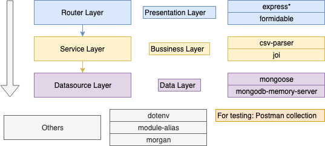

# Fun with CSV Files

The  main goals for this projects were to be simple, easy to mantain and as production-ready as possible:

This is the main architecture decided for this project:

**Router Layer**: In charge of recieving requests and sending the appropiate input information to the service layer as well as receving the response and return it .

**Service Layer:** Main layer, in charge of applying all the bussiness rules like:

- Parsing a csv file (assuming is too big to hold it all in memory at the same time) line per line by using the appropiate configuration of the provider.

- Creating, getting and updating the configuration of a provider. This configuration will be saved as an object with field names that needs to be filled either with the name of the field for the provider or null if the provider doesn't send that field. Example: Apple provider will only send "UUID" field as "appleQuickID" this will be represented as a configuration like this:

  `{
  	"name": "Apple",
  	"fieldMatch": {
  		"uuid": "appleQuickID",
  		"vin": null,
  		"make": null,
  		"model" : null,
  		"mileage": null,
  	    "year": null,
  	    "price": null,
  	    "zipCode": null,
  	    "createDate": null,
  	    "updateDate": null
  	}
  }`

- Getting the file, that returns all the data parsed from the file. This service usage is intented only for demostration purposes since it returns the whole file. If the file is too big the service should be refactor it in order to include pagination for rows.

**Data layer:** Layer intended to save and retrieve each of the three collections that are available:

- Provider: Contains the configuration for a provider. Name is unique.
- File: Contains the file minimal data as well as the providerID for each csv file that is stored.
- Data: Contains the rows of each file.

## Library Stack

**express**: Initially i was not planning on using this library since it was not needed, but later I realize that not using it could make you think that I don't know how to use it, so I add it. The second reason it was used is because it gives an appropiate order to the API by using the Router abstraction. Using this tool includes the use of other libraries that work with it like body-parser.

**formidable:** Used so any provider without access to a RESTClient (like Postman) can upload a csv file. I choose this tool also because it can save big files witout any issues.  

**csv-parser:** Along with nodeJS internal library fs I used this library to parse the stream of the saved CSV file row by row and save this rows asynchronally witouth having to upload the whole file in memory. 

**joi:** Validate the input request so any Service can make sure that it recieves the information needed.

**mongoose:** Object Modeling tool that enables to create predefined models for each of the collections used in the Data layer.

**mongo-memory-server:**  In memory database, used as requested. Holds the data.

**dotenv:** Essential for setting variables that depends on the environment. In this case MAX_CSV_FILE_SIZE will hold the maximum size of CSV file that can be loaded, processed and stored.

**module-alias:** In order to avoid the require dots hell. Not essential buy I like it.

**morgan:** Minimal logging tool. Logging is always essential.

Tests: I tested this project using Postman requests, I saved the collection i used in the project's directory so they can be reused.

------------

In summary, I really loved working on this project, many things could be improved though, like adding unit test for each layer with **jest**, adding logging for each layer, using typescript for a better type definition, adding dependency injection between each layer and having functional (e2e) tests that can be run as part of a pre-commit hook of git. Sadly, I only had time to do this.  Thank you for the challenge.

Diego Berolatti
